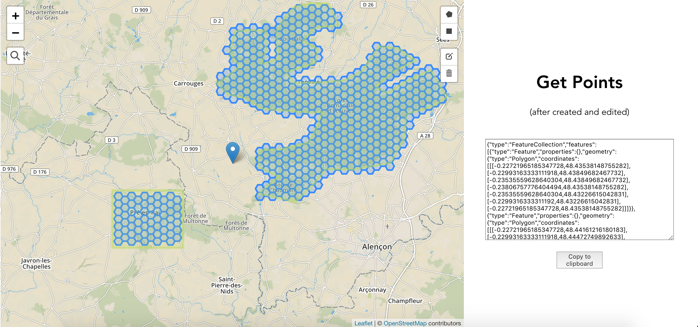

# playground-leaflet



https://playground-leaflet.netlify.com/

I created this project to use Leaflet, leaflet-search and Leaflet.Draw on vuejs without using the Vue2leaflet plugin (which is great but too light for my work). Also, I wanted the code to be maintainable.

1. You can create zones (polygon / rectangle) at the positions you want
2. You can generate hexgrids immediately afterwards.
3. You can especially edit them
4. You can also get the geojson of his hexgrids live on the clipboard

## To do (for the moment) :

- Fix remove option
- Generate automatic markers from an API
- Display the marker and its information on the screen area
- Use a cluster-marker
- Add a cache layer with cacheman
- Button to refresh the cache and / or disable

!! Thanks to the fluctuo company for whom I realized this great project !!

## Project setup

```
npm install
yarn
```

### Compiles and hot-reloads for development

```
npm run serve
yarn serve
```

### Compiles and minifies for production

```
npm run build
```
